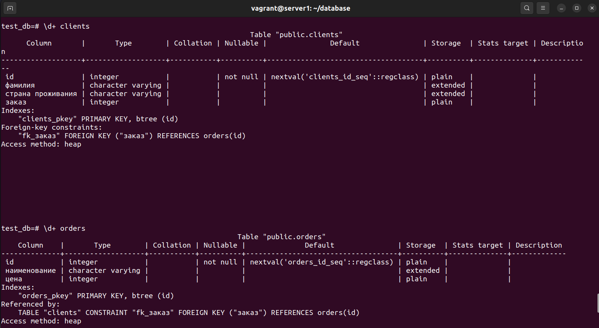

1. **Задача 1**

    Используя Docker, поднимите инстанс PostgreSQL (версию 12) c 2 volume, в который будут складываться данные БД и бэкапы.

    docker-compose.yaml:    

        version: '3.6'

        volumes:
        data: {}
        backup: {}

        services:

            postgres:
                image: postgres:12
                container_name: postgr
                ports:
                - "0.0.0.0:5432:5432"
                volumes:
                - data:/Users/nikolayroshchin/DevOps/database/ex_2/data/
                - backup:/Users/nikolayroshchin/DevOps/database/ex_2/backup/
                environment:
                POSTGRES_USER: "test-user"
                POSTGRES_PASSWORD: "12345"
                POSTGRES_DB: "first_db"
                restart: always

    Поднимаем docker-compose и запускаем bash внутри: 

    - docker-compose up -d
    - sudo docker exec -it pg12 bash

2. **Задача 2**

    Создаём пользователя и требуемые таблицы orders и clients

    

    - итоговый список БД:

    

    - описание таблиц:

    

    - SQL-запрос для выдачи списка пользователей с правами над таблицами test_db и список пользователей с правами над таблицами test_db:

    

3. **Задача 3**

    Наполняем таблицы данными:

    

4. **Задача 4**

    Связываем записи из таблиц запросами и выведем пользователей, которые сделали заказ:

    

5. **Задача 5**

    Получите полную информацию по выполнению запроса выдачи всех пользователей из задачи 4 (используя директиву EXPLAIN).

    

    Чтение данных из таблицы clients происходит с использованием метода Seq Scan — последовательного чтения данных. Значение 0.00 — ожидаемые затраты на получение первой строки. Второе — 18.10 — ожидаемые затраты на получение всех строк. rows - ожидаемое число строк, которое должен вывести этот узел плана. При этом так же предполагается, что узел выполняется до конца. width - ожидаемый средний размер строк, выводимых этим узлом плана (в байтах). Каждая запись сравнивается с условием "заказ" IS NOT NULL. Если условие выполняется, запись вводится в результат. Иначе — отбрасывается.

6. **Задача 6**

    

    

    
