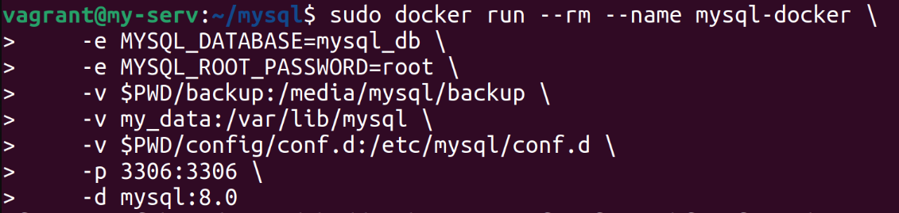
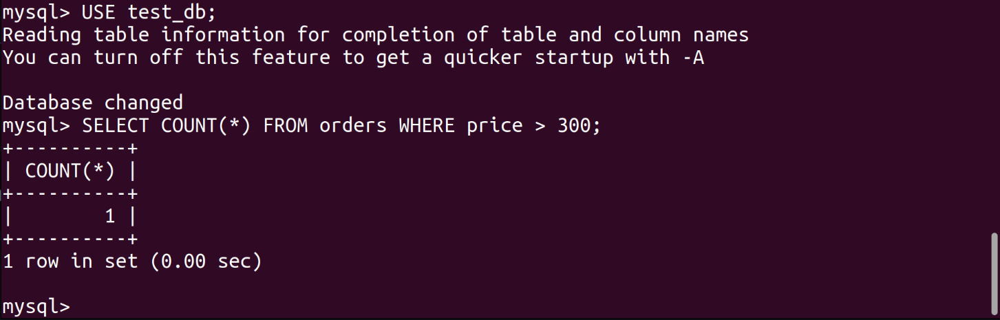
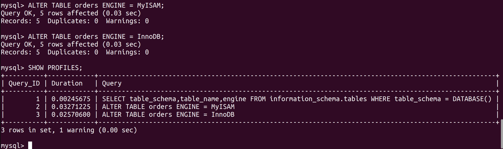

1. **Задача 1**

	Используя Docker, поднимите инстанс MySQL (версию 8). Данные БД сохраните в volume.
	
	
	
	Изучите бэкап БД и восстановитесь из него.
	
	
	
	Перейдите в управляющую консоль mysql внутри контейнера.
	
	
	
	Используя команду \h, получите список управляющих команд.

	Найдите команду для выдачи статуса БД и приведите в ответе из её вывода версию сервера БД.
	
	
	
	Подключитесь к восстановленной БД и получите список таблиц из этой БД.
	
	Приведите в ответе количество записей с price > 300.
	
	
	
2. **Задача 2**

	Создайте пользователя test в БД c паролем test-pass, используя:

	- плагин авторизации mysql_native_password
	- срок истечения пароля — 180 дней
	- количество попыток авторизации — 3
	- максимальное количество запросов в час — 100
	- аттрибуты пользователя:
	- Фамилия "Pretty"
	- Имя "James".
	
	
	
	Предоставьте привелегии пользователю test на операции SELECT базы test_db
	
	
	
	Используя таблицу INFORMATION_SCHEMA.USER_ATTRIBUTES, получите данные по пользователю test
	
	
	
3. **Задача 3**

	Установите профилирование SET profiling = 1. Изучите вывод профилирования команд SHOW PROFILES;
	
	Исследуйте, какой engine используется в таблице БД test_db
	
	
	
	Измените engine и приведите время выполнения и запрос на изменения из профайлера в ответе:

	- на MyISAM,
	- на InnoDB.
	
	
	
4. **Задача 4**

	Изучите файл my.cnf в директории /etc/mysql.

	Измените его согласно ТЗ (движок InnoDB):

	- скорость IO важнее сохранности данных;
	- нужна компрессия таблиц для экономии места на диске;
	- размер буффера с незакомиченными транзакциями 1 Мб;
	- буффер кеширования 30% от ОЗУ;
	- размер файла логов операций 100 Мб.
	
	Приведите в ответе изменённый файл my.cnf.
	
	
	
	
