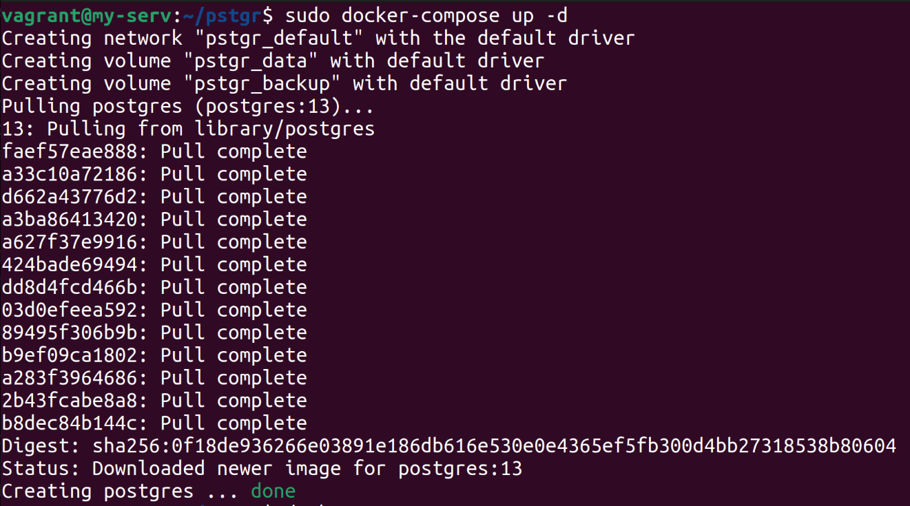
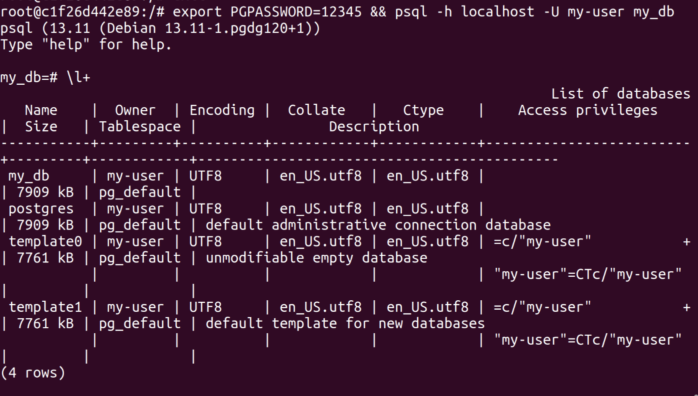
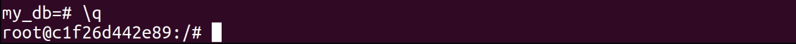
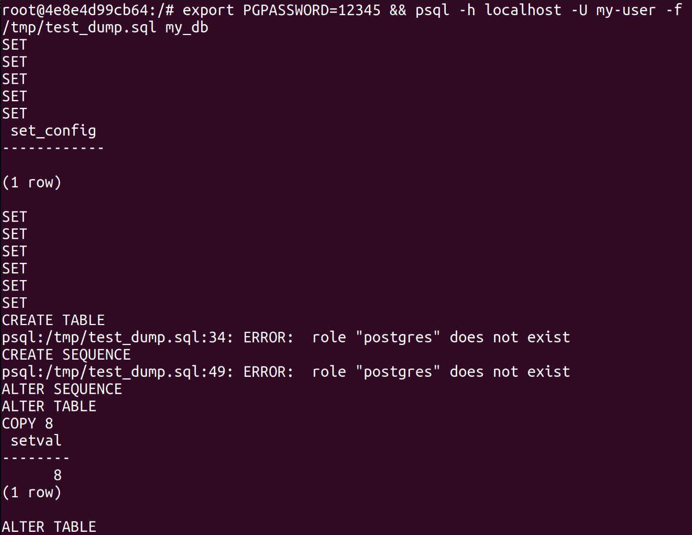
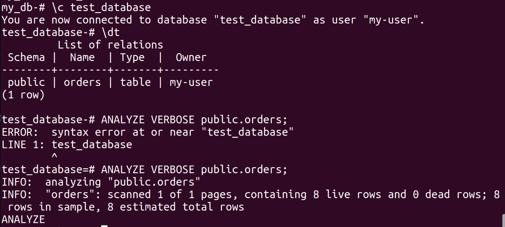
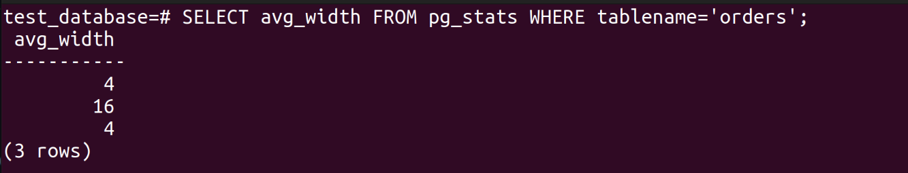
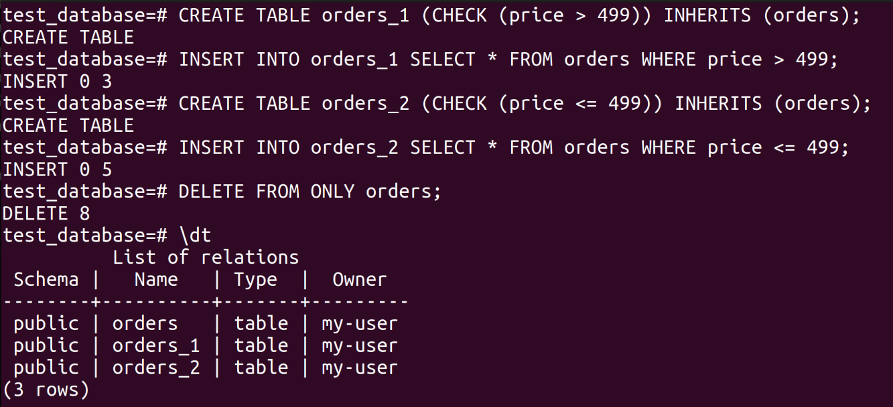
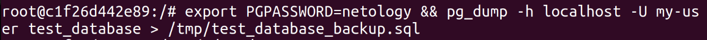

1. **Задача 1**

   Используя Docker, поднимите инстанс PostgreSQL (версию 13). Данные БД сохраните в volume.

   version: '3.6'

   volumes:
   data: {}
   backup: {}

   services:

      postgres:
            image: postgres:13
            container_name: postgres
            ports:
            - "0.0.0.0:5432:5432"
            volumes:
            - data:/home/vagrant/pstgr/data/
            - backup:/home/vagrant/pstgr/backup/
            environment:
            POSTGRES_USER: "my-user"
            POSTGRES_PASSWORD: "12345"
            POSTGRES_DB: "my_db"
            restart: always

   

   

   Подключитесь к БД PostgreSQL, используя psql.

   Воспользуйтесь командой \? для вывода подсказки по имеющимся в psql управляющим командам.

   - вывода списка БД,

   

   - подключения к БД

   [db-4_1-4](./db-4_1-4.png)

   <details><summary>вывода списка таблиц</summary>

   ```bash
   my_db=# \dtS
                     List of relations
      Schema   |          Name           | Type  |  Owner  
   ------------+-------------------------+-------+---------
   pg_catalog | pg_aggregate            | table | my-user
   pg_catalog | pg_am                   | table | my-user
   pg_catalog | pg_amop                 | table | my-user
   pg_catalog | pg_amproc               | table | my-user
   pg_catalog | pg_attrdef              | table | my-user
   pg_catalog | pg_attribute            | table | my-user
   pg_catalog | pg_auth_members         | table | my-user
   pg_catalog | pg_authid               | table | my-user
   pg_catalog | pg_cast                 | table | my-user
   pg_catalog | pg_class                | table | my-user
   pg_catalog | pg_collation            | table | my-user
   pg_catalog | pg_constraint           | table | my-user
   pg_catalog | pg_conversion           | table | my-user
   pg_catalog | pg_database             | table | my-user
   pg_catalog | pg_db_role_setting      | table | my-user
   pg_catalog | pg_default_acl          | table | my-user
   pg_catalog | pg_depend               | table | my-user
   pg_catalog | pg_description          | table | my-user
   pg_catalog | pg_enum                 | table | my-user
   pg_catalog | pg_event_trigger        | table | my-user
   pg_catalog | pg_extension            | table | my-user
   pg_catalog | pg_foreign_data_wrapper | table | my-user
   pg_catalog | pg_foreign_server       | table | my-user
   pg_catalog | pg_foreign_table        | table | my-user
   pg_catalog | pg_index                | table | my-user
   pg_catalog | pg_inherits             | table | my-user
   pg_catalog | pg_init_privs           | table | my-user
   pg_catalog | pg_language             | table | my-user
   pg_catalog | pg_largeobject          | table | my-user
   pg_catalog | pg_largeobject_metadata | table | my-user
   pg_catalog | pg_namespace            | table | my-user
   pg_catalog | pg_opclass              | table | my-user
   pg_catalog | pg_operator             | table | my-user
   pg_catalog | pg_opfamily             | table | my-user
   pg_catalog | pg_partitioned_table    | table | my-user
   pg_catalog | pg_policy               | table | my-user
   pg_catalog | pg_proc                 | table | my-user
   pg_catalog | pg_publication          | table | my-user
   pg_catalog | pg_publication_rel      | table | my-user
   pg_catalog | pg_range                | table | my-user
   pg_catalog | pg_replication_origin   | table | my-user
   pg_catalog | pg_rewrite              | table | my-user
   pg_catalog | pg_seclabel             | table | my-user
   pg_catalog | pg_sequence             | table | my-user
   pg_catalog | pg_shdepend             | table | my-user
   pg_catalog | pg_shdescription        | table | my-user
   pg_catalog | pg_shseclabel           | table | my-user
   pg_catalog | pg_statistic            | table | my-user
   pg_catalog | pg_statistic_ext        | table | my-user
   pg_catalog | pg_statistic_ext_data   | table | my-user
   pg_catalog | pg_subscription         | table | my-user
   pg_catalog | pg_subscription_rel     | table | my-user
   pg_catalog | pg_tablespace           | table | my-user
   pg_catalog | pg_transform            | table | my-user
   pg_catalog | pg_trigger              | table | my-user
   pg_catalog | pg_ts_config            | table | my-user
   pg_catalog | pg_ts_config_map        | table | my-user
   pg_catalog | pg_ts_dict              | table | my-user
   pg_catalog | pg_ts_parser            | table | my-user
   pg_catalog | pg_ts_template          | table | my-user
   pg_catalog | pg_type                 | table | my-user
   pg_catalog | pg_user_mapping         | table | my-user
   (62 rows)
   ```
   </details>  

   <details><summary>вывода описания содержимого таблиц</summary>

   ```bash
   my_db=# \dS+
                                             List of relations
      Schema   |              Name               | Type  |  Owner  | Persistence |    Size    | Description 
   ------------+---------------------------------+-------+---------+-------------+------------+-------------
   pg_catalog | pg_aggregate                    | table | my-user | permanent   | 56 kB      | 
   pg_catalog | pg_am                           | table | my-user | permanent   | 40 kB      | 
   pg_catalog | pg_amop                         | table | my-user | permanent   | 80 kB      | 
   pg_catalog | pg_amproc                       | table | my-user | permanent   | 64 kB      | 
   pg_catalog | pg_attrdef                      | table | my-user | permanent   | 8192 bytes | 
   pg_catalog | pg_attribute                    | table | my-user | permanent   | 456 kB     | 
   pg_catalog | pg_auth_members                 | table | my-user | permanent   | 40 kB      | 
   pg_catalog | pg_authid                       | table | my-user | permanent   | 48 kB      | 
   pg_catalog | pg_available_extension_versions | view  | my-user | permanent   | 0 bytes    | 
   pg_catalog | pg_available_extensions         | view  | my-user | permanent   | 0 bytes    | 
   pg_catalog | pg_cast                         | table | my-user | permanent   | 48 kB      | 
   pg_catalog | pg_class                        | table | my-user | permanent   | 136 kB     | 
   pg_catalog | pg_collation                    | table | my-user | permanent   | 248 kB     | 
   pg_catalog | pg_config                       | view  | my-user | permanent   | 0 bytes    | 
   pg_catalog | pg_constraint                   | table | my-user | permanent   | 48 kB      | 
   pg_catalog | pg_conversion                   | table | my-user | permanent   | 48 kB      | 
   pg_catalog | pg_cursors                      | view  | my-user | permanent   | 0 bytes    | 
   pg_catalog | pg_database                     | table | my-user | permanent   | 48 kB      | 
   pg_catalog | pg_db_role_setting              | table | my-user | permanent   | 8192 bytes | 
   pg_catalog | pg_default_acl                  | table | my-user | permanent   | 8192 bytes | 
   pg_catalog | pg_depend                       | table | my-user | permanent   | 488 kB     | 
   pg_catalog | pg_description                  | table | my-user | permanent   | 376 kB     | 
   pg_catalog | pg_enum                         | table | my-user | permanent   | 0 bytes    | 
   pg_catalog | pg_event_trigger                | table | my-user | permanent   | 8192 bytes | 
   pg_catalog | pg_extension                    | table | my-user | permanent   | 48 kB      | 
   pg_catalog | pg_file_settings                | view  | my-user | permanent   | 0 bytes    | 
   pg_catalog | pg_foreign_data_wrapper         | table | my-user | permanent   | 8192 bytes | 
   pg_catalog | pg_foreign_server               | table | my-user | permanent   | 8192 bytes | 
   pg_catalog | pg_foreign_table                | table | my-user | permanent   | 8192 bytes | 
   pg_catalog | pg_group                        | view  | my-user | permanent   | 0 bytes    | 
   pg_catalog | pg_hba_file_rules               | view  | my-user | permanent   | 0 bytes    | 
   pg_catalog | pg_index                        | table | my-user | permanent   | 64 kB      | 
   pg_catalog | pg_indexes                      | view  | my-user | permanent   | 0 bytes    | 
   pg_catalog | pg_inherits                     | table | my-user | permanent   | 0 bytes    | 
   pg_catalog | pg_init_privs                   | table | my-user | permanent   | 56 kB      | 
   pg_catalog | pg_language                     | table | my-user | permanent   | 48 kB      | 
   pg_catalog | pg_largeobject                  | table | my-user | permanent   | 0 bytes    | 
   pg_catalog | pg_largeobject_metadata         | table | my-user | permanent   | 0 bytes    | 
   pg_catalog | pg_locks                        | view  | my-user | permanent   | 0 bytes    | 
   pg_catalog | pg_matviews                     | view  | my-user | permanent   | 0 bytes    | 
   pg_catalog | pg_namespace                    | table | my-user | permanent   | 48 kB      | 
   pg_catalog | pg_opclass                      | table | my-user | permanent   | 48 kB      | 
   pg_catalog | pg_operator                     | table | my-user | permanent   | 144 kB     | 
   pg_catalog | pg_opfamily                     | table | my-user | permanent   | 48 kB      | 
   pg_catalog | pg_partitioned_table            | table | my-user | permanent   | 8192 bytes | 
   pg_catalog | pg_policies                     | view  | my-user | permanent   | 0 bytes    | 
   pg_catalog | pg_policy                       | table | my-user | permanent   | 8192 bytes | 
   pg_catalog | pg_prepared_statements          | view  | my-user | permanent   | 0 bytes    | 
   pg_catalog | pg_prepared_xacts               | view  | my-user | permanent   | 0 bytes    | 
   pg_catalog | pg_proc                         | table | my-user | permanent   | 688 kB     | 
   pg_catalog | pg_publication                  | table | my-user | permanent   | 0 bytes    | 
   pg_catalog | pg_publication_rel              | table | my-user | permanent   | 0 bytes    | 
   pg_catalog | pg_publication_tables           | view  | my-user | permanent   | 0 bytes    | 
   pg_catalog | pg_range                        | table | my-user | permanent   | 40 kB      | 
   pg_catalog | pg_replication_origin           | table | my-user | permanent   | 8192 bytes | 
   pg_catalog | pg_replication_origin_status    | view  | my-user | permanent   | 0 bytes    | 
   pg_catalog | pg_replication_slots            | view  | my-user | permanent   | 0 bytes    | 
   pg_catalog | pg_rewrite                      | table | my-user | permanent   | 656 kB     | 
   pg_catalog | pg_roles                        | view  | my-user | permanent   | 0 bytes    | 
   pg_catalog | pg_rules                        | view  | my-user | permanent   | 0 bytes    | 
   pg_catalog | pg_seclabel                     | table | my-user | permanent   | 8192 bytes | 
   pg_catalog | pg_seclabels                    | view  | my-user | permanent   | 0 bytes    | 
   pg_catalog | pg_sequence                     | table | my-user | permanent   | 0 bytes    | 
   pg_catalog | pg_sequences                    | view  | my-user | permanent   | 0 bytes    | 
   pg_catalog | pg_settings                     | view  | my-user | permanent   | 0 bytes    | 
   pg_catalog | pg_shadow                       | view  | my-user | permanent   | 0 bytes    | 
   pg_catalog | pg_shdepend                     | table | my-user | permanent   | 40 kB      | 
   pg_catalog | pg_shdescription                | table | my-user | permanent   | 48 kB      | 
   pg_catalog | pg_shmem_allocations            | view  | my-user | permanent   | 0 bytes    | 
   pg_catalog | pg_shseclabel                   | table | my-user | permanent   | 8192 bytes | 
   pg_catalog | pg_stat_activity                | view  | my-user | permanent   | 0 bytes    | 
   pg_catalog | pg_stat_all_indexes             | view  | my-user | permanent   | 0 bytes    | 
   pg_catalog | pg_stat_all_tables              | view  | my-user | permanent   | 0 bytes    | 
   pg_catalog | pg_stat_archiver                | view  | my-user | permanent   | 0 bytes    | 
   pg_catalog | pg_stat_bgwriter                | view  | my-user | permanent   | 0 bytes    | 
   pg_catalog | pg_stat_database                | view  | my-user | permanent   | 0 bytes    | 
   pg_catalog | pg_stat_database_conflicts      | view  | my-user | permanent   | 0 bytes    | 
   pg_catalog | pg_stat_gssapi                  | view  | my-user | permanent   | 0 bytes    | 
   pg_catalog | pg_stat_progress_analyze        | view  | my-user | permanent   | 0 bytes    | 
   pg_catalog | pg_stat_progress_basebackup     | view  | my-user | permanent   | 0 bytes    | 
   pg_catalog | pg_stat_progress_cluster        | view  | my-user | permanent   | 0 bytes    | 
   pg_catalog | pg_stat_progress_create_index   | view  | my-user | permanent   | 0 bytes    | 
   pg_catalog | pg_stat_progress_vacuum         | view  | my-user | permanent   | 0 bytes    | 
   pg_catalog | pg_stat_replication             | view  | my-user | permanent   | 0 bytes    | 
   pg_catalog | pg_stat_slru                    | view  | my-user | permanent   | 0 bytes    | 
   pg_catalog | pg_stat_ssl                     | view  | my-user | permanent   | 0 bytes    | 
   pg_catalog | pg_stat_subscription            | view  | my-user | permanent   | 0 bytes    | 
   pg_catalog | pg_stat_sys_indexes             | view  | my-user | permanent   | 0 bytes    | 
   pg_catalog | pg_stat_sys_tables              | view  | my-user | permanent   | 0 bytes    | 
   pg_catalog | pg_stat_user_functions          | view  | my-user | permanent   | 0 bytes    | 
   pg_catalog | pg_stat_user_indexes            | view  | my-user | permanent   | 0 bytes    | 
   pg_catalog | pg_stat_user_tables             | view  | my-user | permanent   | 0 bytes    | 
   pg_catalog | pg_stat_wal_receiver            | view  | my-user | permanent   | 0 bytes    | 
   pg_catalog | pg_stat_xact_all_tables         | view  | my-user | permanent   | 0 bytes    | 
   pg_catalog | pg_stat_xact_sys_tables         | view  | my-user | permanent   | 0 bytes    | 
   pg_catalog | pg_stat_xact_user_functions     | view  | my-user | permanent   | 0 bytes    | 
   pg_catalog | pg_stat_xact_user_tables        | view  | my-user | permanent   | 0 bytes    | 
   pg_catalog | pg_statio_all_indexes           | view  | my-user | permanent   | 0 bytes    | 
   pg_catalog | pg_statio_all_sequences         | view  | my-user | permanent   | 0 bytes    | 
   pg_catalog | pg_statio_all_tables            | view  | my-user | permanent   | 0 bytes    | 
   pg_catalog | pg_statio_sys_indexes           | view  | my-user | permanent   | 0 bytes    | 
   pg_catalog | pg_statio_sys_sequences         | view  | my-user | permanent   | 0 bytes    | 
   pg_catalog | pg_statio_sys_tables            | view  | my-user | permanent   | 0 bytes    | 
   pg_catalog | pg_statio_user_indexes          | view  | my-user | permanent   | 0 bytes    | 
   pg_catalog | pg_statio_user_sequences        | view  | my-user | permanent   | 0 bytes    | 
   pg_catalog | pg_statio_user_tables           | view  | my-user | permanent   | 0 bytes    | 
   pg_catalog | pg_statistic                    | table | my-user | permanent   | 248 kB     | 
   pg_catalog | pg_statistic_ext                | table | my-user | permanent   | 8192 bytes | 
   pg_catalog | pg_statistic_ext_data           | table | my-user | permanent   | 8192 bytes | 
   pg_catalog | pg_stats                        | view  | my-user | permanent   | 0 bytes    | 
   pg_catalog | pg_stats_ext                    | view  | my-user | permanent   | 0 bytes    | 
   pg_catalog | pg_subscription                 | table | my-user | permanent   | 8192 bytes | 
   pg_catalog | pg_subscription_rel             | table | my-user | permanent   | 0 bytes    | 
   pg_catalog | pg_tables                       | view  | my-user | permanent   | 0 bytes    | 
   pg_catalog | pg_tablespace                   | table | my-user | permanent   | 48 kB      | 
   pg_catalog | pg_timezone_abbrevs             | view  | my-user | permanent   | 0 bytes    | 
   pg_catalog | pg_timezone_names               | view  | my-user | permanent   | 0 bytes    | 
   pg_catalog | pg_transform                    | table | my-user | permanent   | 0 bytes    | 
   pg_catalog | pg_trigger                      | table | my-user | permanent   | 8192 bytes | 
   pg_catalog | pg_ts_config                    | table | my-user | permanent   | 40 kB      | 
   pg_catalog | pg_ts_config_map                | table | my-user | permanent   | 56 kB      | 
   pg_catalog | pg_ts_dict                      | table | my-user | permanent   | 48 kB      | 
   pg_catalog | pg_ts_parser                    | table | my-user | permanent   | 40 kB      | 
   pg_catalog | pg_ts_template                  | table | my-user | permanent   | 40 kB      | 
   pg_catalog | pg_type                         | table | my-user | permanent   | 120 kB     | 
   pg_catalog | pg_user                         | view  | my-user | permanent   | 0 bytes    | 
   pg_catalog | pg_user_mapping                 | table | my-user | permanent   | 8192 bytes | 
   pg_catalog | pg_user_mappings                | view  | my-user | permanent   | 0 bytes    | 
   pg_catalog | pg_views                        | view  | my-user | permanent   | 0 bytes    | 
   (129 rows)
   ```
   </details>

   - выхода из psql

   

2. **Задача 2**

   Используя psql, создайте БД test_database.

   

   Изучите бэкап БД.

   Восстановите бэкап БД в test_database.

   

   Перейдите в управляющую консоль psql внутри контейнера.

   Подключитесь к восстановленной БД и проведите операцию ANALYZE для сбора статистики по таблице.

   

   Используя таблицу pg_stats, найдите столбец таблицы orders с наибольшим средним значением размера элементов в байтах.

   

3. **Задача 3**

   Архитектор и администратор БД выяснили, что ваша таблица orders разрослась до невиданных размеров и поиск по ней занимает долгое время. Вам как успешному выпускнику курсов DevOps в Нетологии предложили провести разбиение таблицы на 2: шардировать на orders_1 - price>499 и orders_2 - price<=499.

   Предложите SQL-транзакцию для проведения этой операции.

   

   Можно ли было изначально исключить ручное разбиение при проектировании таблицы orders?

   CREATE RULE orders_insert_to_more AS ON INSERT TO orders WHERE ( price > 499 ) DO INSTEAD INSERT INTO orders_more_499_price VALUES (NEW.*);
   CREATE RULE orders_insert_to_less AS ON INSERT TO orders WHERE ( price <= 499 ) DO INSTEAD INSERT INTO orders_less_499_price VALUES (NEW.*);

4. **Задача 4**

   Используя утилиту pg_dump, создайте бекап БД test_database.

   

   Как бы вы доработали бэкап-файл, чтобы добавить уникальность значения столбца title для таблиц test_database?

   title character varying(80) NOT NULL UNIQUE,